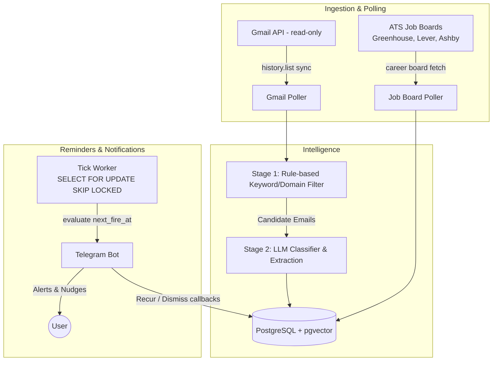

# Cadence 🛫

> Inbox-aware job-search assistant for students and new grads hunting internships and entry-level engineering roles.

Cadence connects to your Gmail (read-only), detects Online Assessments (OAs) and interview invitations using a fast two-stage filter (rules + LLM), manages reminders over Telegram with interactive recurrence, polls company career boards, and automates cold-email nudges.

---

## Architecture Overview



---

## Core Features

- **Privacy-Minimal:** Read-only Gmail scope; email bodies and subjects are processed in memory and never persisted to the database or logged.
- **Smart OA / Interview Reminders:** Interactive Telegram inline buttons (`[🔁 Recur] [✖ Dismiss]`) that fire at 10:00 & 19:00 user local time with DST resilience.
- **Career Board Polling:** High-frequency diffing on Greenhouse, Lever, and Ashby boards with pgvector similarity matching against resume profiles.
- **Application Outreach Nudges:** Detects confirmation emails and nudges users with tailored cold-email drafts and LinkedIn recruiter search links.

---

## Quickstart

### 1. Prerequisites
- Python 3.12+
- Docker & Docker Compose
- Telegram Bot Token ([@BotFather](https://t.me/BotFather))
- Google Cloud Console OAuth 2.0 Client Credentials
- Anthropic API Key

### 2. Environment Setup
```bash
cp .env.example .env
# Fill in your database URL, Fernet encryption key, Telegram bot token, and API keys
```

Generate a Fernet secret key:
```bash
python -c "from cryptography.fernet import Fernet; print(Fernet.generate_key().decode())"
```

### 3. Local Development with Docker Compose
```bash
docker compose up --build
```

### 4. Running Migrations
```bash
alembic upgrade head
```

### 5. Running Tests & Quality Checks
```bash
pytest
ruff check .
mypy src tests
```
